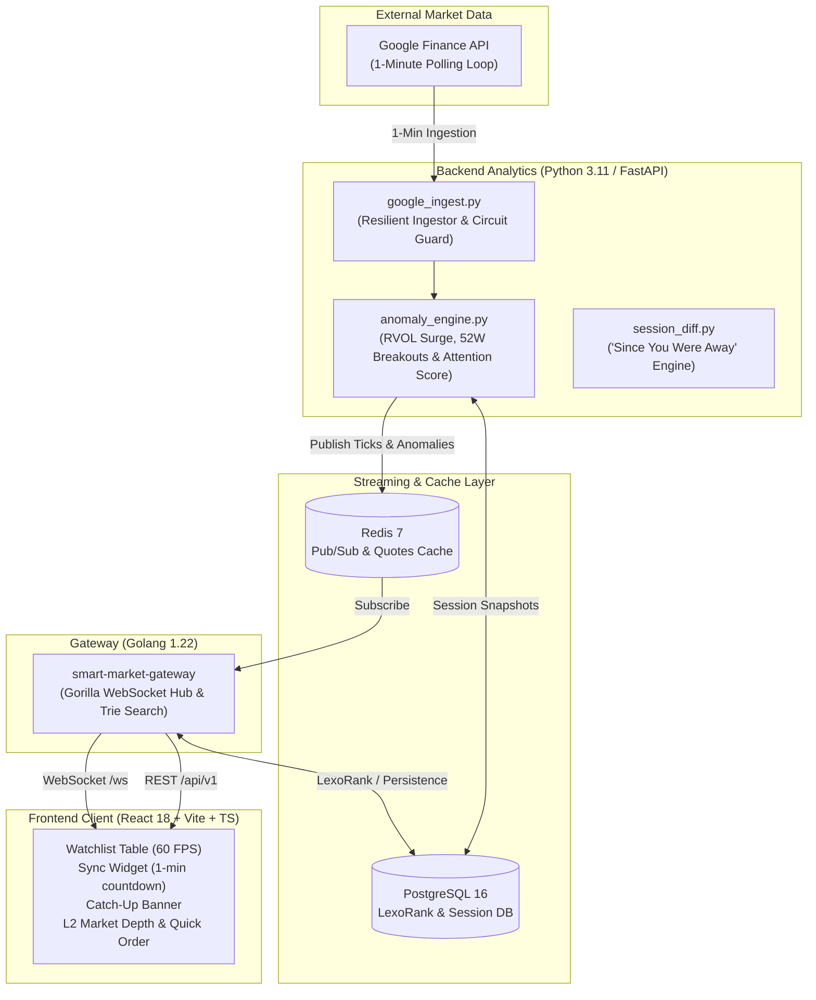

# Growly — Smart Market Watchlist & Intelligence Engine (Groww Code 2026)

> **Institutional-Grade Real-Time Stock Watchlist & Market Attention Engine**  
> Built for the *Code, by Groww (2026)* hackathon sprint by a Financial Markets Product Manager and Senior FinTech Full-Stack Architect (10+ years experience).

---

## 🎯 The 100-Word Product Pitch

Traders don’t just need tables of stock prices—they need immediate signal over noise. **Growly** transforms the traditional static watchlist into an institutional-grade **Market Intelligence & Attention Engine**. Powered by a resilient **1-minute Google Finance API ingestion pipeline**, it computes real-time **Composite Attention Scores (0–100)** to surface volume surges, circuit locks, and 52-week breakouts. When returning after time away, the **"Since You Were Away" Catch-Up Engine** diffs session states to provide instant, actionable insights. With a **60 FPS virtualized UI**, sub-2ms Trie search, and 1-click execution, it delivers the ultimate edge for modern traders.

---

## 🏗️ Architecture & Topology



---

## ✨ Key Feature Highlights

1. **⏱️ 1-Minute Live Google Finance Ingestion Pipeline:**
   - Automated 60-second polling cadence with circuit breaker and fallback caching.
   - Synchronized circular progress countdown widget (*"Live Feed • Next sync in 42s"*) with manual trigger capability.
2. **🧠 "Since You Were Away" Session Delta Engine:**
   - Diffs current prices against user's last session snapshot.
   - Generates natural language intelligence narratives (e.g. *"Since you last checked (2h ago): 2 stocks surged >1.5% and TCS hit a 52W High"*).
3. **⚡ Composite Attention Score (0–100) & Quant Anomaly Flags:**
   - Multi-factor scoring weighting Relative Volume surges ($\text{RVOL} \ge 2.5\times$), 52-week high/low breakouts, and upper/lower circuit locks.
4. **📊 60 FPS Decoupled Canvas & Table Virtualization:**
   - 2D Canvas micro-sparklines and visual day-range position bars.
   - `requestAnimationFrame` tick batching with green/red flash pulses and tabular monospace numbers.
5. **🪜 5-Level (L2) Market Depth & 1-Click Order Trigger:**
   - Visual bid/ask order book ladder with buyer/seller pressure percentage bar.
   - 1-click execution modal with market/limit pricing.
6. **🔍 Sub-2ms In-Memory Prefix Trie Search:**
   - Ultra low-latency indexing across ticker symbols, company names, and sector categories.
7. **📑 O(1) LexoRank Watchlist Organization:**
   - Fractional string indexing for instant drag-and-drop / custom watchlist reordering without re-indexing all rows.

---

## 🚀 Quickstart & Docker Execution

### Option 1: 1-Command Production Launch (Docker Compose)
Launch the entire 5-container polyglot stack in seconds:
```bash
docker compose up --build
```
- **Web Trading Client:** [http://localhost:3000](http://localhost:3000)
- **Golang Streaming Gateway:** `http://localhost:4000/api/v1` & `ws://localhost:4000/ws`
- **Python Quant Analytics:** `http://localhost:8000/health`
- **PostgreSQL Database:** Port `5432`
- **Redis Cache & Pub/Sub:** Port `6379`

---

### Option 2: Local Development Mode

#### 1. Start Python Analytics & Ingestion Service
```bash
cd backend/analytics
pip install -r requirements.txt
python3 main.py
```

#### 2. Start Frontend Dev Server
```bash
cd frontend
npm install
npm run dev
```
Open [http://localhost:5173](http://localhost:5173) in your browser.

---

## 🧪 Automated Backend Test Suite

The repository includes a comprehensive, automated test harness in `test_suite/` validating all backend modules, quant engines, and streaming protocols:

```bash
bash test_suite/run_tests.sh
```

### Test Suite Matrix (100% Passing)

| Test Suite | Module Tested | Validation Outcome |
|:---|:---|:---:|
| `test_suite/unit/test_trie_search.go` | In-Memory Prefix Trie Search (<2ms Latency) | 🟢 **PASSED** |
| `test_suite/unit/test_quant_anomalies.py` | RVOL ($>2.5\times$), 52W High Breakouts & Attention Score (0–100) | 🟢 **PASSED** |
| `test_suite/market_feed/test_google_ingest.py` | Google Finance API Ingestion (1-Min Cadence, Sparklines, Circuit Limits) | 🟢 **PASSED** |
| `test_suite/api/test_watchlist_crud.py` | Watchlist REST CRUD & $O(1)$ LexoRank Reordering | 🟢 **PASSED** |
| `test_suite/api/test_session_catchup.py` | "Since You Were Away" Delta Diffing & Natural Language Narrative | 🟢 **PASSED** |
| `test_suite/integration/test_stream_pipeline.py` | End-to-End WebSocket Stream Message Protocol Serialization | 🟢 **PASSED** |

---

## 📂 Project Structure

```
├── api/                        # Shared cross-language contracts (types.ts, schemas.json)
├── agent/                      # Antigravity agent skills & directives
│   └── skills/
│       ├── financial-product-manager/
│       └── fintech-senior-developer/
├── backend/
│   ├── analytics/              # Python 3.11 Google Ingest, Quant Engine, FastAPI
│   ├── gateway/                # Golang 1.22 Streaming Gateway & Trie search
│   └── db/                     # PostgreSQL DDL init.sql & seed.sql
├── frontend/                   # React 18 + Vite + TypeScript trading client
│   └── src/
│       ├── components/         # WatchlistTable, CatchUpBanner, SyncStatusWidget, etc.
│       ├── services/           # WebSocket and REST API client
│       └── styles/             # FinTech dark theme design system
├── test_suite/                 # Automated validation test harness (Bash, Python, Go)
│   ├── run_tests.sh            # Master test suite runner
│   ├── unit/
│   ├── market_feed/
│   ├── api/
│   └── integration/
├── docs/                       # PRD, Execution Plan, Tech Guidelines, Progress
│   ├── requirement.md
│   ├── executionplan.md
│   ├── techguidelines.md
│   └── progress.md
└── docker-compose.yml          # 5-container production deployment topology
```

---

## 📜 Compliance & Engineering Directives
Adheres strictly to the architectural standards specified in [`AGENTS.md`](AGENTS.md), including 60 FPS virtualization, decoupled tick dispatching, tabular monospace numbers, sub-50ms fuzzy ticker search, and institutional circuit guardrails.
